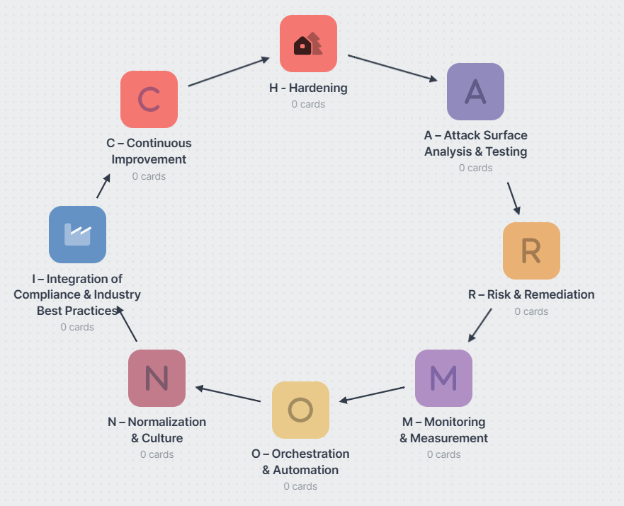

# HARMONIC
A lifecycle, methodology, and strategy for continually improving cybersecurity operations within an organization.

# H - Hardening
### Objective
Establish a strong security baseline and reduce the overall attack surface from the outset. 
### Activities
1. Conduct inventory analysis and Bill of Materials processes 
2. Apply secure configurations (e.g., CIS Benchmarks) to systems, apps, containers. 
3. Patch and update software, firmware, and operating systems. 
4. Enforce least privilege access, secure default settings, and encryption where applicable. 
5. Integrate compliance requirements (ISO 27001, PCI DSS, FedRAMP, etc.) into baseline security standards. 

# A - Attack Surface Analysis and Testing
### Objective
Identify possible entry points for adversaries and systematically test for vulnerabilities.
### Activities
1. Conduct threat modeling (e.g., STRIDE, PASTA) and architecture reviews.
2. Use both SCA (Software Composition Analysis) and SAST (Static Application Security Testing) to detect known vulnerabilities (CVE) and common weaknesses (CWE).
3. Perform DAST (Dynamic Application Security Testing), penetration testing, or fuzzing to find runtime issues.
4. Reference MITRE CAPEC for common attack patterns and OWASP Top 10 for common web or API vulnerabilities.
# R - Risk and Remediation
### Objective
Prioritize discovered issues and execute a structured plan to remediate them.
### Activities
1. Classify and score vulnerabilities based on severity, exploitability, and potential business impact (e.g., CVSS scoring).
2. Devise remediation strategies (patching, code refactoring, architectural changes) aligned to risk appetite.
3. Track vulnerability lifecycle (e.g., using an issue tracker or GRC tool) from detection through validation.
4. Incorporate automated or manual code fixes into continuous integration pipelines.
# M - Monitoring and Measurement
### Objective
Ensure continuous oversight of security posture and detect anomalous activities in real time.
### Activities
1. Implement SIEM solutions for centralized log management and threat detection.
2. Establish real-time alerting and anomaly detection (e.g., via intrusion detection systems, EDR/XDR).
3. Define security metrics (e.g., mean time to detect/respond, patch cadence) and track them over time.
4. Conduct routine integrity checks and compliance audits (e.g., NIST 800-53 controls, ISO 27002 guidelines).
# O - Orchestration and Automation
### Objective
Streamline security processes and reduce human error by automating repetitive or critical tasks.
### Activities
- Integrate security scanning (SAST, DAST, SCA) and compliance checks into CI/CD pipelines.
- Use Infrastructure as Code (IaC) and Configuration Management tools (e.g., Ansible, Terraform) to enforce hardened baselines at scale.
- Automate container security checks (image scanning, runtime protection) and ephemeral infrastructure checks (serverless, container orchestration).
- Employ SOAR platforms (Security Orchestration, Automation, and Response) for automated incident response playbooks.
# N - Normalization and Culture
### Objective
Embed security as a routine, “business as usual” practice throughout the organization.
### Activities
- Provide ongoing security awareness training tailored to different roles (developers, admins, product owners).
- Formalize policies and standards that align with recognized frameworks (NIST CSF, ISO 27034 for secure SDLC, etc.).
- Encourage “Shift Left” mentality by building secure coding practices into early SDLC phases.
- Promote a shared “security-first” culture, where every stakeholder feels responsible for protecting systems and data.
# I - Integration of Compliance and Industry Best Practices
### Objective
Harmonize internal processes with external requirements, ensuring legal and regulatory compliance.
### Activities
- Map internal policies to relevant frameworks/regulations (e.g., HIPAA, GDPR, NIST 800-171).
- Continuously update compliance checklists and test controls for evidence of ongoing adherence.
- Leverage recognized frameworks (ISO 27001, PCI DSS, SOC 2) for audits and certifications.
- Engage in supply chain security measures (e.g., NIST 800-161, ISO/IEC 20243) to validate third-party and hardware components.
# C - Continuous Improvement
### Objective
Evolve and refine the entire security program based on feedback loops, new threats, and lessons learned.
### Activities
- Post-mortem reviews of incidents and near-misses to drive changes in processes or technology.
- Periodic reevaluation of threat models, risk assessments, and architectural designs.
- Update runbooks, playbooks, and training programs to reflect new vulnerabilities or emerging attack techniques.
- Engage in vulnerability disclosure or bug bounty programs for ongoing external feedback.